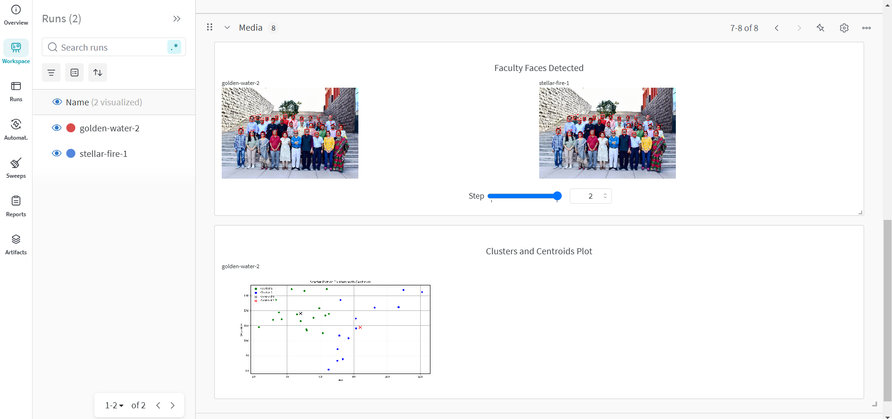

# MLPR LAB 5 - Distance Classification

## Overview
This Lab implements distance-based classification using K-Means clustering on face detection features (hue and saturation) from images. It follows best practices for version control, automation, containerization, and experiment tracking.

-------------------------------------

## Output Plots:

-------------------------------------

## Report:
## Answer the following questions within your report:

#### 1. What are the common distance metrics used in distance-based classification algorithms? 
Common distance metrics used in distance-based classification algorithms include Euclidean distance, Manhattan distance, Mahalanobis distance, Minkowski distance, and Cosine similarity. These metrics determine how similar or different two data points are based on their feature values.

#### 2. What are some real-world applications of distance-based classification algorithms?
Real-world applications of distance-based classification algorithms include recommender systems, image recognition, anomaly detection, medical diagnosis, and text classification. For example, KNN is used in disease prediction by comparing a patient’s symptoms with past cases.

#### 3. Explain various distance metrics. 
- Euclidean Distance: Measures straight-line distance between two points in space.
- Manhattan Distance: Computes distance by summing absolute differences along each dimension.
- Mahalanobis Distance: Accounts for correlations between variables, making it useful for detecting outliers in multivariate data.
- Minkowski Distance: A generalized form of Euclidean and Manhattan distance.
- Cosine Similarity: Measures the angle between two vectors, often used in text analysis.

#### 4. What is the role of cross validation in model performance? 
Cross-validation helps assess model performance by splitting data into multiple training and testing sets. It prevents overfitting and ensures the model generalizes well to unseen data by providing an unbiased evaluation of its predictive ability.

#### 5. Explain variance and bias in terms of KNN? 
In KNN, high bias occurs when K is large, leading to oversimplification and underfitting. High variance occurs when K is small, making the model sensitive to noise and prone to overfitting. A balanced K value helps optimize the bias-variance tradeoff.

-------------------------------------
## Wandb Project Dashboard:

